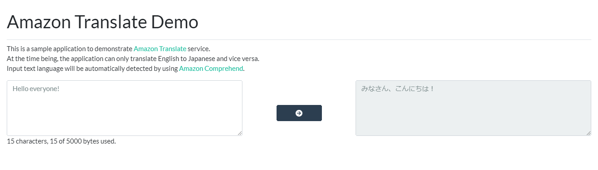

# Amazon Translate Demo
> A sample express website to demonstrate [Amazon Translate](https://aws.amazon.com/translate/) and [Amazon Comprehend](https://aws.amazon.com/comprehend/) services.

## Screenshots


## Features
- Automatic language detection using Amazon Recognition (I limited the language to Japan and English only)
- Character count and bytes display (Amazon Translate document size limit is 5000 bytes)
- Client side and server side error display
- Responsive display

## Installation
1. Clone the project.
2. Install dependencies
    ```sh
    npm install
    ```
3. Start server
   ```sh
   npm start
   ```
4. Access the website via [localhost:3000](localhost:3000)

Make sure that 

## Upcoming features
1. File upload / PDF read function
2. Real-time translation
3. ...

## Meta

Abdul Rifqi Al Abqary – rifqi.alabqary@gmail.com

Distributed under the MIT license. See ``LICENSE`` for more information.

[https://github.com/reefqi037/amazon-translate-demo](https://github.com/reefqi037/amazon-translate-demo)

## License
MIT

[MIT](https://github.com/reefqi037/amazon-translate-demo/blob/master/LICENSE) © Abdul Rifqi Al Abqary